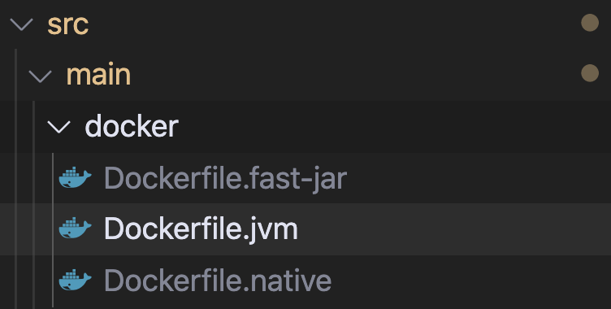
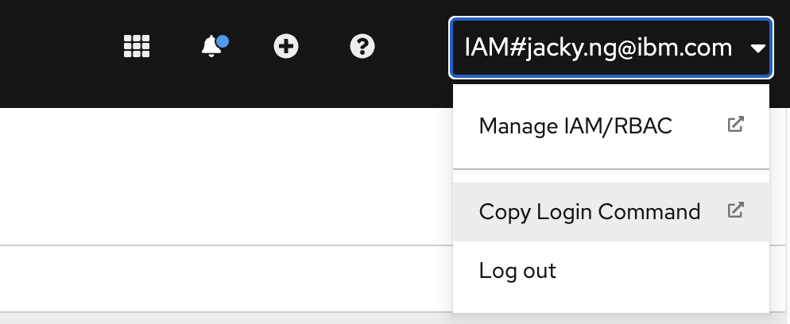
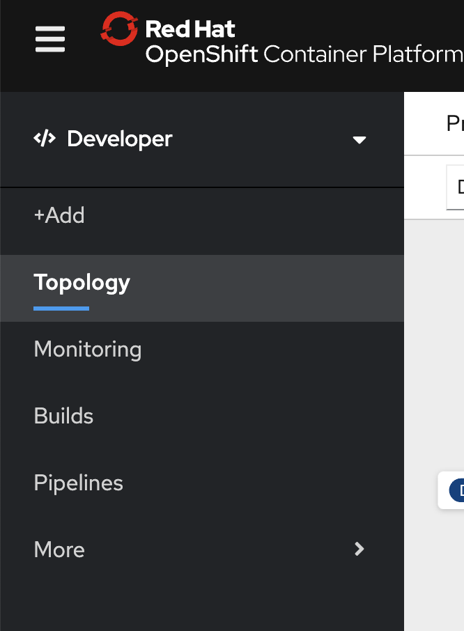
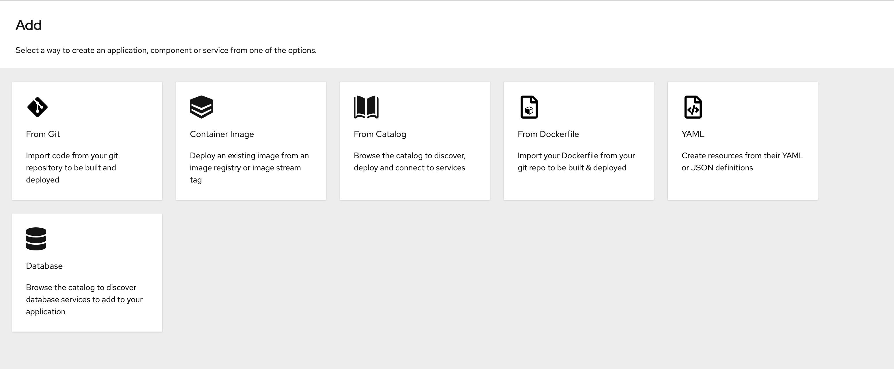
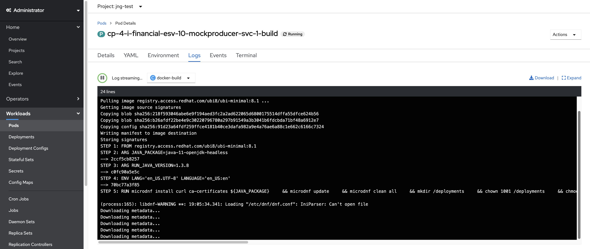
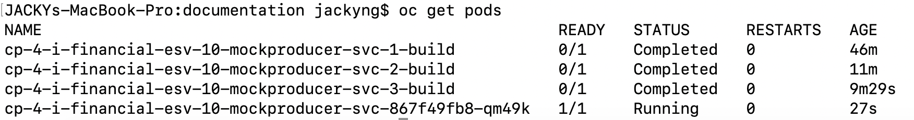
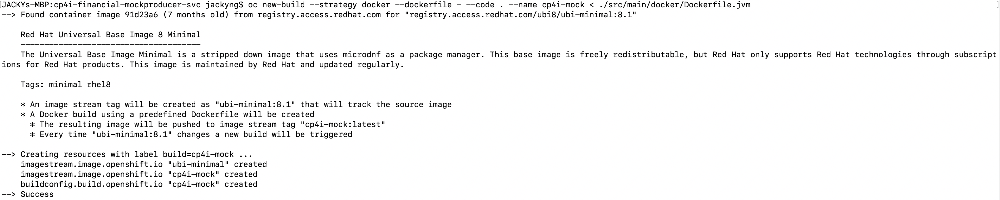
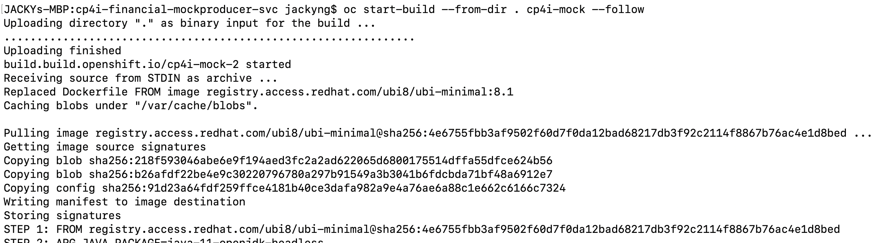

# Deploying a Java (Quarkus) Application to OpenShift for use with Kafka

## Overview
- I'll just outline a few simple steps and different deployment paths for getting an application (in this case Java) onto OpenShift.
- This is for the purposes of a Quarkus application as it provides us various functionalities without having to create it ourselves.
- Lastly this is for a application to be used with IBM Event Streams but can be modified for a regular Kafka deployment.

## Prerequisites
**OpenShift Container Platform Cluster**
- We will assume you have a 4.x Cluster as we will make use of Operators.
- The OpenShift CLI `oc`.

**Cloud Pak for Integration**
- Likely CP4Iv2020.2.x and newer

**IBM Event Streams**
- IBM Event Streams v10.x+

**Java**
- Java Development Kit (JDK) v1.8+ (Java 8+)

**Maven**

**Quarkus**
- This assumes your application was bootstrapped using Quarkus since it provides us some Cloud Native approaches to deploy our application.

**An IDE of your choice**
- Visual Studio Code is used in this scenario.

**Git**

**Docker**

## Creating the Secrets for the Applications
- These secrets will house the necessary sensitive information that our application will need. This assumes that your application is providing various configuration settings via Environment Variables. The non-sensitive information can also be provided via ConfigMaps but we will use Secrets here.
- As we're going to connecting to IBM Event Streams on the Cloud Pak for Integration you will need to have your SCRAM credentials, your truststore certificates, truststore password, external bootstrap server address, and topic names all of which can be obtained from the IBM Event Streams UI via `Connect to this cluster`.
- Create an OpenShift/Kubernetes secret to securely hold our truststore certificate.
```shell
oc create secret generic eventstreams-truststore-cert --from-file=es-cert.p12
```

- We need to create another secret to house our SCRAM credentials and truststore password. Create a yaml and name it something like `application-secret.yaml`. You can fill the fields inside the yaml with your desired environment variables (to provide to your application). 

```yaml
apiVersion: v1
kind: Secret
metadata:
  name: example-secret
  namespace: my-namespace
type: Opaque 
data: 
  SCRAM_USERNAME: base64-encoded-scram-username
  SCRAM_PASSWORD: base64-encoded-scram-password
  CERT_PASSWORD: base64-encoded-truststore-password
stringData: 
  CERT_LOCATION: path-to-certificate
  TOPIC_NAME: your-topic-name
  BOOTSTRAP_SERVERS: external-bootstrap-server-address
```
- *Note*: Values inside `data` must be base64 encoded, where as values in `stringData` will be base64 encoded for you and then placed inside `data`. For more information on OpenShift/OpenShift secrets you can go [here](https://docs.openshift.com/container-platform/4.5/nodes/pods/nodes-pods-secrets.html). In bash you can run something like the following to encode your value.
```shell
echo "your-string" | base64
```
- Make sure that you're in the same project or namespace as where you intend to deploy your application and apply this yaml.
```shell
oc apply -f application-secret.yaml
```


## Deployment from a Github Repository and the OpenShift Web UI
- This deployment path will have you push your project or application to Github. OpenShift will then kick off a build from your the Dockerfile from the repository.
- As previously stated this assumes that you have a Quarkus application. The reason for this is that it provides Dockerfiles already configured. Go to `src/main/docker/`

- As you can see these Dockerfiles are already created for you. Primarily for now we'll be interested in the `Dockerfile.jvm` file.
- Inside the `Dockerfile.jvm` file in the comments it outlines a few simple steps you can do but I'll iterate what we'll need.
- Package or build your Java application with the following command first from the root of your project folder:
```shell
mvn package
```
- Open the `.gitignore` file and commment back in or remove the target folder under Maven:
```shell
# Maven
target/
pom.xml.tag
pom.xml.releaseBackup
pom.xml.versionsBackup
release.properties
```
- The reason for this is because when you run `mvn package` the code is compiled into jar file that reside inside the `target/` folder when we build our Docker image it will need access to those jar files.

- Now, make sure that you are logged into your OpenShift cluster. Go to your OpenShift cluster from the Web UI, and then to the top right corner to get the token so you can login via CLI.

- Click Display token and then copy and paste the first command it into your Terminal that's in the form of the following:
```shell
oc login --token=random-token --server=https://ocp-cluster-url:port
```

- Assuming that we have our secrets created that will we will now need to push our code to the Github repository. For the sake of brevity, let's assume this has already happened.
- Since we should already still be logged into our OpenShift cluster, go the OpenShift Web UI under `Developer` mode. Note that this assumes your IAM User has the proper access rights to do so. You can change between `Administrator` and `Developer` via this dropdown.

- On the left side of the menu click `+Add`.
- Now select `From Dockerfile`:

- Under `Git Repo URL` provide the URL to your GitHub repository.
- Under `Dockerfile path` provide `src/main/docker/Dockerfile.jvm`. 
- The rest of the settings you can provide as you see fit to customize.
- Hit `Create`. This process will take a little while as this kicks off a Build pod that will be built from the Dockerfile.
- If you go back into the `Administrator` view you can look at the status of the build pod in `Workloads/Pods` and the pod will be named something like `your-application-1-build`. You can also look at the status of your build pod by doing something like:
```shell
oc logs your-build-pod-name
```


- The application is now technically deployed on OpenShift but it will not work because it has these environment variables that it's trying to grab that don't actually exist. If you look at the logs of your application pod which will be in the form of something like `application-name-randomstring` you will be able to see the application not finding the environment variables. To remedy this we now need to provide the previously created secrets to our `Deployment` of the application.
- Let's mount the Event Streams truststore certificate as a volume to your deployment.
```shell
oc get deployments
```
```shell
oc set volume deployments/your-deployment-name --add --type=secret --secret-name=eventstreams-truststore-cert --mount-path=/certs/ssl
```
- Note the `--mount-path=`. This should have parity with the secrets yaml file value for `stringData.CERT_LOCATION:`. In this example the path is `/certs/ssl` so in the secrets it should be `stringData.CERT_LOCATION: /certs/ssl/es-cert.p12` as we're mounting our `es-cert.p12` file from the `eventstreams-truststore-cert` secret into `/certs/ssl` inside a pod.

- Let's also provide the data from the other secret that housed the other credentials.
```shell
oc set env deployments/your-application-name --from=secret/example-secret
```

- Now we need to start a new build. Get the name of your buildconfig first:
```shell
oc get buildconfig
```
- Kick off a new build and like previously, wait for the Build pod to finish building before it will kick off the actual application pod.
```shell
oc start-build build-config-name
```

- Check the status of your application pods either from the OpenShift console web UI or from terminal with `oc get pods -n your-project-namespace`. Note that since we started a new build of the application the name of the build pod will be something like `application-name-2-build` or however many new builds you kick off. However, the actual application pod will still be something like `application-name-randomstring`. 



## Deploying a Local Machine via the CLI
- Similar to the previous section that deployed via the OpenShift web console, this will make use of the constructed Dockerfiles that were bootstrapped at the creation of the Quarkus application in `src/main/docker`.
- Also like the previous section this will make use of Secrets to house our sensitive information so that we can provide the Quarkus and Kafka application with the proper environment variables to connect.
- Again similar to the previous section, make sure that you are logged into your OpenShift cluster. Go to your OpenShift cluster from the Web UI, and then to the top right corner to get the token so you can login via CLI.

- Click Display token and then copy and paste the first command it into your Terminal that's in the form of the following:
```shell
oc login --token=random-token --server=https://ocp-cluster-url:port
```
- Within the route of your application/project folder build your application with Maven.
```shell
mvn package
```
- Now for the first real step we need to create a new BuildConfig for our application like so:
```shell
oc new-build --strategy docker --dockerfile - --code . --name your-buildconfig-name < ./src/main/docker/Dockerfile.jvm
```
- Things of note:
  - We're giving it `--strategy docker` to indicate that we're user a Docker image.
  - The `--dockerfile -` means that we're going to be providing a streamed Dockerfile by ways of `< ./src/main/docker/Dockerfile.jvm`. Note that this will also allow you to provide inline Dockerfiles if you so desire.
  - Next, `--code .` indicates that we're going to be using the current folder and project as the context to upload.
  - Lastly `--name your-buildconfig-name` is where you can provide the name of BuildConfig.
- This following is similar to what the command will produce:

- Once that is finished we can start an actual build of our Docker image and upload it as an ImageStream into OpenShift's internal image registry:
```shell
oc start-build --from-dir . your-buildconfig-name --follow
```
- The build will look something like the following and this might take a little bit of time as it needs to compile the Docker image and upload.


- Now let's try and deploy the app which will also automatically create a DeploymentConfig for us that we will need to update.
```shell
oc new-app --image-stream project/your-image-name --name app-name
```
- Things of note:
  - The `--image-stream` flag is telling us where to find our image.
  - `project/your-image-name` is where `oc start-build` will have pushed your image. The `project` will be your current project and `your-app-name` will be the name of the image. To find this you can do `oc get imagestreams` that will show you something like `image-registry.openshift-image-registry.svc:5000/project/image-name`.
  - Lastly `--name app-name` is what you want to name the application and resulting pod.

- If you want to you can watch the logs of the new application pod via `oc logs pod-name` but like the previous section this will fail as it does not have access to the environment variables that the Quarkus application requires for configuration.
- We need to mount into the DeploymentConfig our Event Streams truststore certificate. Replace with your DeploymentConfig name which you can obtain by running `oc get deploymentconfig`
```shell
oc set volume dc/your-deploymentconfig-name --add --type=secret --secret-name=eventstreams-truststore-cert --mount-path=/certs/ssl
```
- Lastly we want to inject the DeploymentConfig with all the environment variables we supplied inside our created Secret. `example-secret` is the name of the secret outlined in the **Creating Secrets** section.
```shell
oc set env dc/your-deploymentconfig-name --from=secret/example-secret
```
- You can now track the application pods and wait for it to be fully deployed:
```shell
oc get pods
oc logs application-pod-name
```